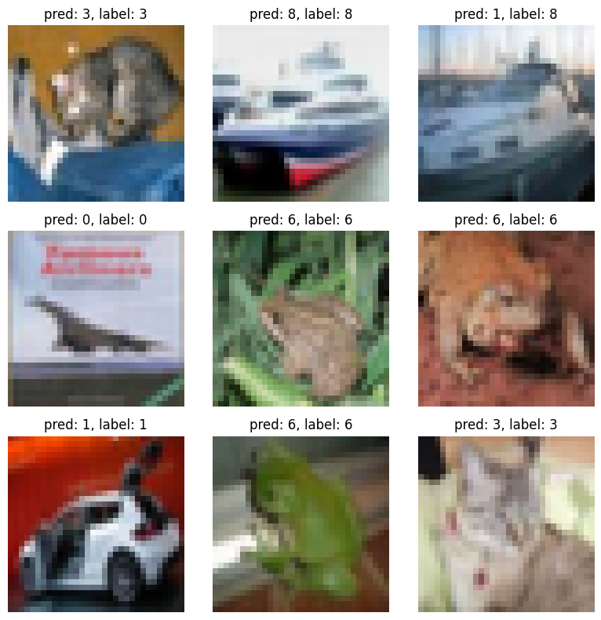

# CNN모델을 활용한 CIFAR-10


## - 프로젝트 구조

```
models/
    custom_cnn.py
utils/
    train.py
    validate.py
    test.py
    visualize.py
main.py
requirements.txt
Dockerfile
```
---
## - 실행법 (for Local PC)

### 1️⃣ Requirements 설치

```
pip install -r requirements.txt
```

### 2️⃣ 실행

```
python main.py
```
---
## - 도커 실행법 (for Docker User)

### 1️⃣ 도커 이미지 빌드

```
docker build -t cifar10-cnn .
```

### 2️⃣ 컨테이너 실행

```
docker run --rm cifar10-cnn
```

---

## - 데이터셋

CIFAR-10 
CIFAR-10은 10개의 클래스(비행기, 자동차, 새, 고양이 등)에 대한 60,000장의 32x32 사이즈의 이미지로 구성된 데이터셋입니다.

데이터셋은 별도의 준비 없이, 실행 시 `torchvision` 라이브러리를 통해 자동으로 다운로드됩니다.

---

## - 결과

40회 에포크 학습 후, 정확도:

```
Validation Accuracy: 80.52% 
Test Accuracy: 79.81%
```

예측 결과 예시:



---
06unoh